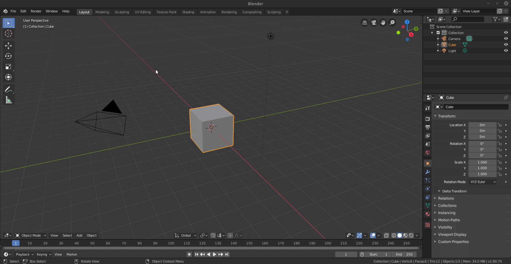
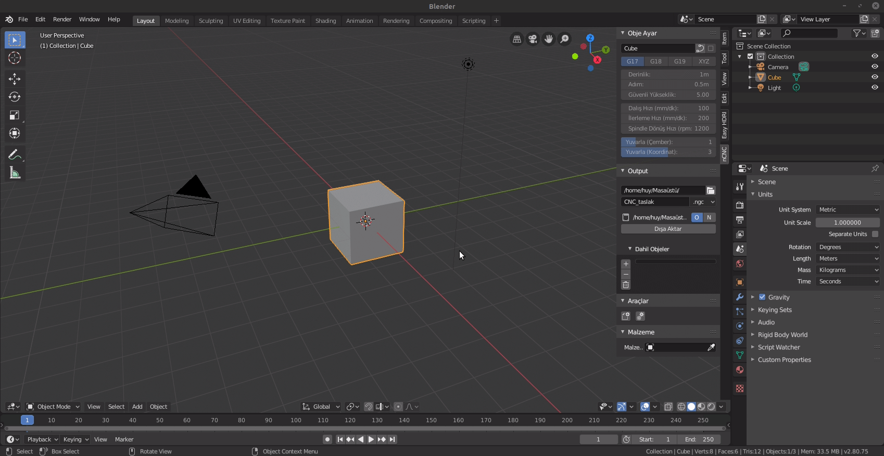
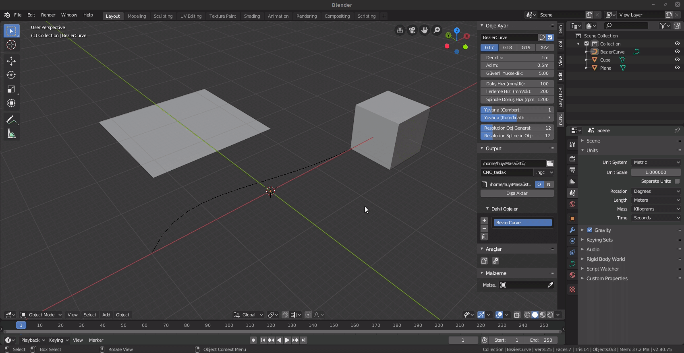
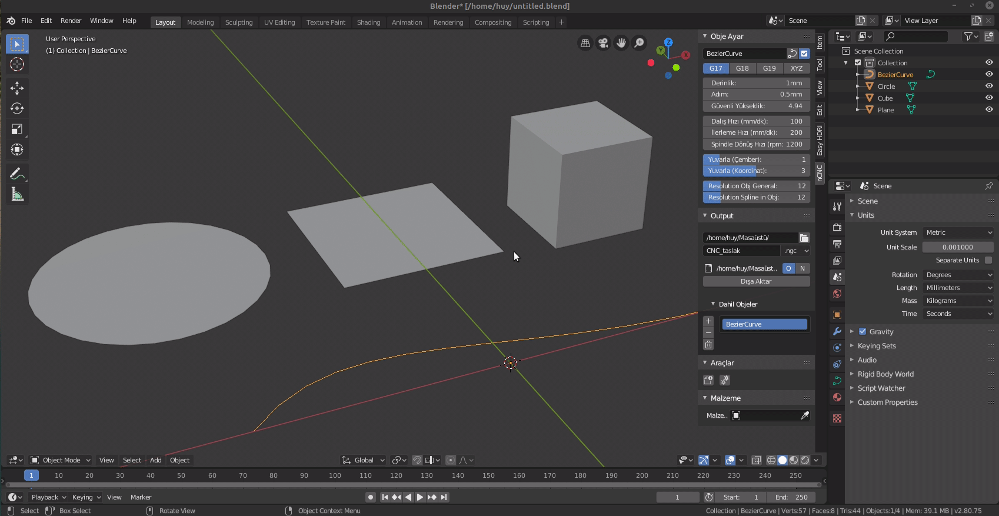
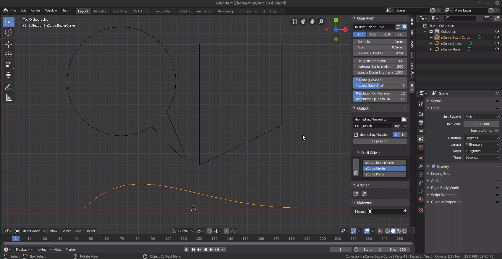
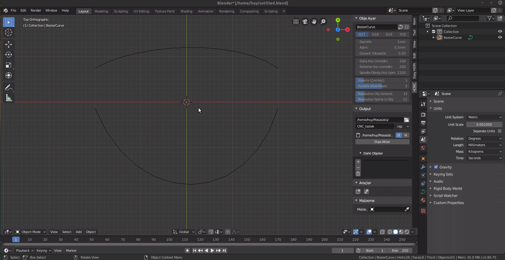
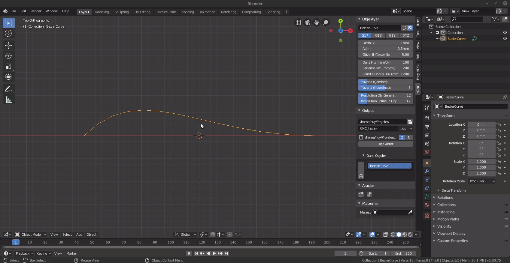

# Blender nCNC

* It converts curves into G code for CNC machining in the Blender 2.8 ( Tr: Blender 2.8'de eğrileri (Curves), CNC'de işlenmek üzere, G koduna dönüştürmektedir.)
* Only tested with the GRBL card and works ( Tr: Sadece GRBL kartıyla denenmiştir ve çalışmaktadır. )
* Development may not continue as support does not continue. ( Tr: Destek olmadığından dolayı geliştirme devam etmeyebilir.)

## Table of content ( İçerik )
* [Installation](#Install)
* [Usage](#Usage)
  * [Quick Clear Objects and Scene Optimize](#Clear-Objects-and-Scene-Optimize)
  * [Quick Scene Optimize](#Only-Scene-Optimize)  
  * [How can I convert to curve](#Convert-to-Curve)
  * [How do I include it in g code](#Include-in-G-code)
  * [How to change to curves resolution](#Resolution-Curve)
  * [How to export G code](#Export-Gcode)
* [License](#License)

## Install

This addon: 

## Usage

### Clear Objects and Scene Optimize
(Tr: Objeleri silinmesi ve sahne ayarlarının optimize edilmesi)

### Only Scene Optimize
(Tr: Sadece sahneyi optimize etme)

### Convert to Curve
(Tr: Curve türüne dönüştürme )

### Include in G code
(Tr: Objeyi G koduna dahil etme)

### Resolution Curve
(Tr: Eğrinin çözünürlüğünü değiştirme)

### Export Gcode
(Tr: G kodunu dışa aktarma)

## License
The nCNC addon is licensed under the terms of the GPL Open Source license and is available for free. ( Tr: Bedava indir kullan )
